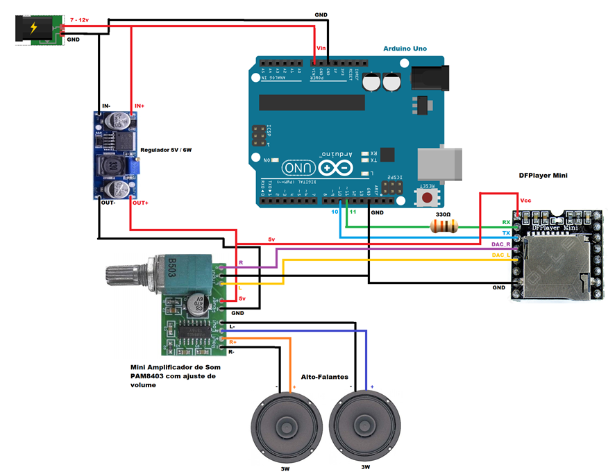
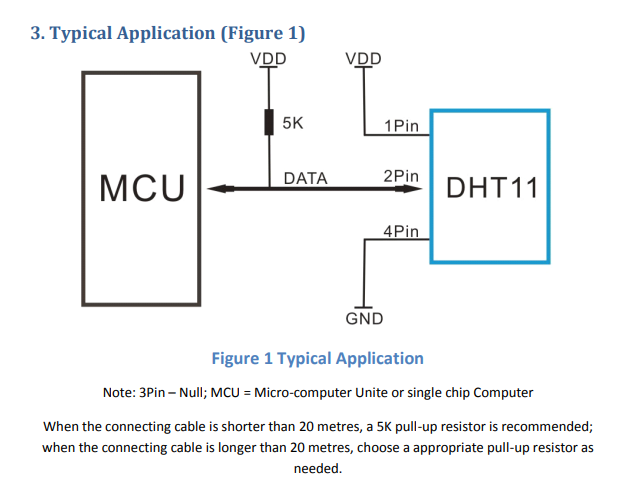
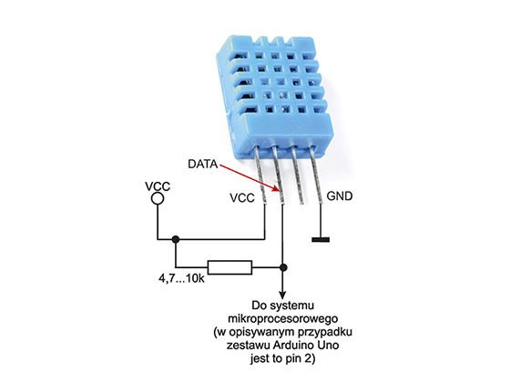
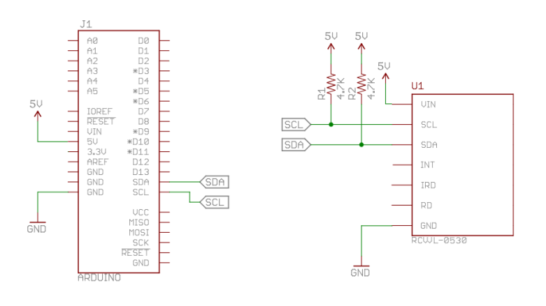
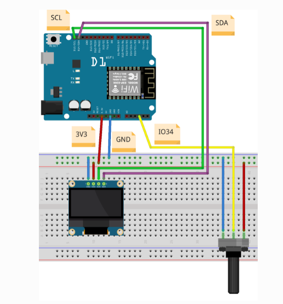
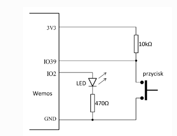

# Arduino Optimum Project

## Wstęp

Niby ogarniam te arduino, ale działać to nic nie działa xD. Teraz to już nawet najprostrzy układ z ekranem.

## Elementy

- 1x MAX30100 (RCWL-0530) (Pulsometr)
- 1x DHT11 (Czujnik temperatury i wilgoci)
- 1x DFPlayer Mini (Odtwarzacz kart/muzyki)
- 1x SSD1306 (Ekran)
- 1x Głośnik
- 1x PAM8403/GF1002 (Wzmacniacz)
- 3x Diody
- 3x Przyciski
- 3x Rezystor 470R
- 3x Rezystor 10k
- 1x ESP32 DEV
- 1x Karta microSD

## Schemat

[Schemat jest pod tym linkiem](/schematic_diagram/optimum-project.pdf)

## Dokumentacje

- [WPROJ](https://studia.elka.pw.edu.pl/f-raw/21Z/103A-ELxxx-ISP-WPROJ/priv//index.html)
- [MAX30100](https://pekolibrary.wordpress.com/2018/05/27/rcwl-0530-max30100/)
- [DHT11](https://kamami.pl/temperatury/197416-dht11.html)
- [DFPlayer Mini](https://picaxe.com/docs/spe033.pdf)
- [PAM8403](https://botland.com.pl/odtwarzacze-mp3-wav-ogg-midi/6641-wzmacniacz-audio-stereo-pam8403-5v-3w-dwukanalowy-zielony-5904422359850.html)

## Żródła na podstawie których został stworzony schemat

### Wzmaczniacz - DFPlayer Mini - Głośnik

### DHT11

### MAX30100

### Ekran

### Przyciski i diody
